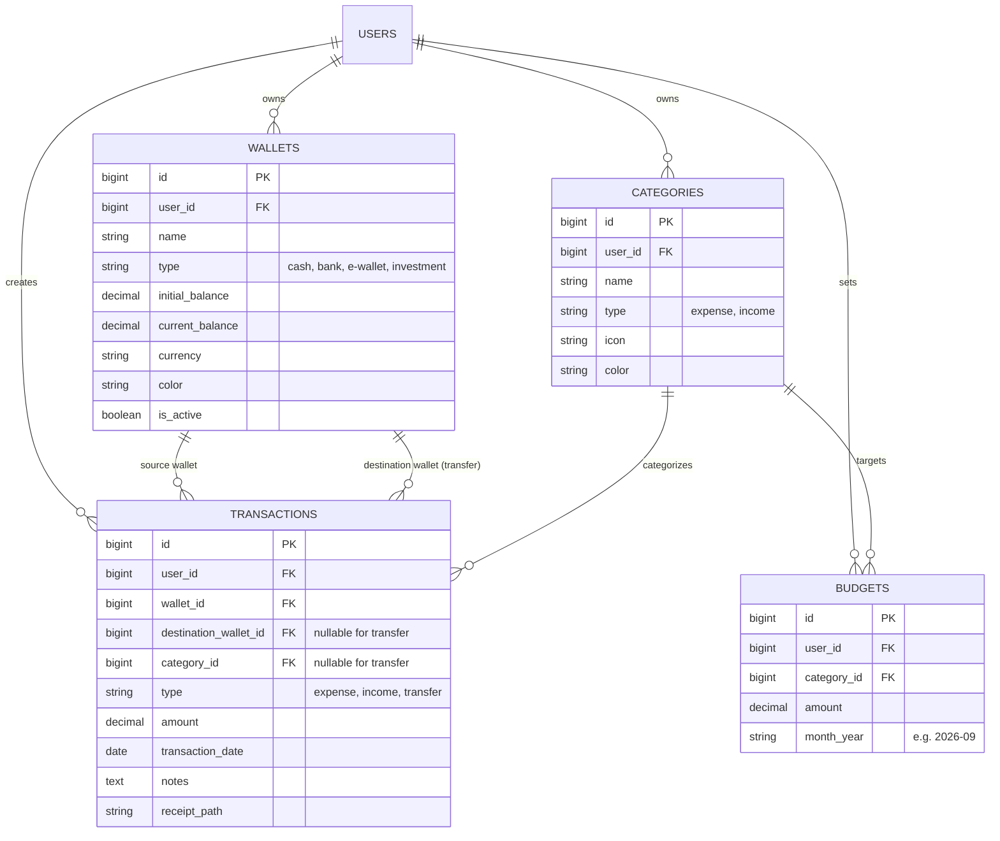

# Rencana Implementasi: Aplikasi Expense Tracker "Kaslo" (Laravel 12 & Filament)

Kaslo adalah aplikasi pelacak keuangan dan pengeluaran (*expense tracker*) modern, fleksibel, dan responsif untuk penggunaan personal maupun UMKM, dibangun di atas **Laravel 12** dan panel admin **Filament v3**.

---

## 1. Analisis Fitur Expense Tracker (Kaslo)

Berikut adalah ringkasan fitur umum yang esensial serta fitur tambahan yang direkomendasikan untuk Kaslo:

### A. Fitur Inti (Core Features)
1. **Multi-Wallet / Accounts (Manajemen Dompet & Rekening)**:
   - Mendukung berbagai jenis akun: Uang Tunai (Cash), Rekening Bank (BCA, Mandiri, BRI, dll.), dan E-Wallet (GoPay, OVO, Dana, ShopeePay).
   - Melacak saldo real-time per akun dan akumulasi saldo total kekayaan bersih (*Net Worth*).
2. **Manajemen Kategori & Subkategori (Income & Expense)**:
   - Kategori pemasukan (Gaji, Usaha, Dividen, Hadiah, dll.).
   - Kategori pengeluaran (Makan & Minum, Tagihan/Utilitas, Transportasi, Belanja, Hiburan, Pendidikan, Kesehatan, dll.).
   - Ikon (Heroicons) dan label warna (*color palette*) untuk visualisasi cepat.
3. **Transaksi (Transactions)**:
   - **Tipe**: Pemasukan (*Income*), Pengeluaran (*Expense*), dan Transfer Antar Akun (*Transfer*).
   - Tanggal transaksi, nominal, akun/dompet, kategori, catatan, dan upload bukti struk/nota (*receipt upload*).
   - Dukungan tags/label (misal: `#liburan`, `#kantor`).
4. **Dashboard Finansial & Visualisasi Interaktif**:
   - Kartu ringkasan: Total Saldo, Total Pemasukan Bulan Ini, Total Pengeluaran Bulan Ini, dan Arus Kas Bersih (*Net Cash Flow*).
   - Grafik Pengeluaran per Kategori (Doughnut / Pie Chart).
   - Grafik Tren Arus Kas Bulanan (Bar / Line Chart perbandingan Pemasukan vs Pengeluaran).
   - Widget transaksi terkini dan status anggaran.

### B. Fitur Unggulan (Advanced & Value-Added)
1. **Target Anggaran (Budgeting per Kategori)**:
   - Menetapkan batas pengeluaran bulanan per kategori.
   - Indikator progres (progress bar) dan status peringatan (Aman, Waspada, Over-budget).
2. **Transaksi Berulang / Tagihan Rutin (Recurring Bills & Subscriptions)**:
   - Mencatat pengeluaran berkala seperti langganan bulanan (Netflix, Spotify, sewa, internet, cicilan).
   - Pengingat jatuh tempo tagihan (*due date reminders*).
3. **Laporan & Ekspor Data**:
   - Filter transaksi fleksibel (periode tanggal, akun, kategori).
   - Ekspor transaksi ke format Excel/CSV atau PDF.
4. **Optimasi Mobile Responsiveness**:
   - Filament v3 bawaan sudah sangat mobile friendly (collapsible sidebar, responsive grid).
   - Kustomisasi tampilan tabel di mobile (kolom utama prioritas, detail lainnya dalam collapsible/modal).
   - Tombol Quick Action / Floating Action Button (FAB) atau tombol tambah transaksi cepat yang ramah sentuhan jari (*thumb-friendly*).
   - Format mata uang Rupiah (`IDR / Rp`) dengan input mask yang intuitif.

---

## 2. Struktur Database & Model

Berikut skema tabel yang direncanakan:

---

## 3. User Review Required

> [!IMPORTANT]
> **Pilihan Mode Pengguna**: Apakah Kaslo direncanakan sebagai aplikasi **Single-User / Personal** (untuk Anda sendiri), atau **Multi-User** (setiap user yang mendaftar punya dompet, data, dan anggaran terisolasi masing-masing)?
> *Rekomendasi*: Multi-User dengan relasi `user_id` di setiap data, sehingga sangat fleksibel dan aman jika di kemudian hari ingin dipakai bersama keluarga atau multi-tenant.

> [!NOTE]
> **Database Engine**: Saat ini `.env` dikonfigurasi menggunakan `sqlite`. Jika ingin menggunakan MySQL di Laragon (misal: database `kaslo`), kami bisa mengonfigurasi `.env` ke MySQL sekarang.

---

## 4. Rencana Tahapan Implementasi (Roadmap)

### Fase 1: Setup Framework & Instalasi Filament v3
- Update nama aplikasi di `.env` menjadi `Kaslo`.
- Konfigurasi PHP CLI & Composer dari Laragon.
- Instalasi paket Filament v3 (`filament/filament:^3.x`) dan konfigurasi Panel Provider (`admin` atau `app`).
- Konfigurasi tema, brand logo/teks "Kaslo", favicon, dan localization bahasa Indonesia / mata uang Rupiah.

### Fase 2: Skema Database & Model Eloquent
- Buat file migrasi, Model, dan Factory untuk:
  - `Wallet` (Dompet/Akun)
  - `Category` (Kategori Pengeluaran & Pemasukan)
  - `Transaction` (Transaksi pengeluaran, pemasukan, transfer)
  - `Budget` (Anggaran bulanan)
- Implementasikan logic observer / event untuk auto-update saldo dompet saat transaksi dibuat, diubah, atau dihapus.
- Buat Seeder dasar (kategori umum Indonesia seperti Makanan, Transportasi, Gaji, dll., dan beberapa akun default seperti Kas Tunai, BCA, GoPay).

### Fase 3: Pembuatan Resource Filament (CRUD)
- `WalletResource`: Daftar dompet, tambah dompet baru, warna & ikon, rekap saldo.
- `CategoryResource`: Manajemen kategori pemasukan & pengeluaran beserta ikon visual.
- `TransactionResource`:
  - Form transaksi yang responsif, rapi, dan cepat.
  - Dropdown dinamis berdasarkan tipe (Pengeluaran / Pemasukan / Transfer).
  - Mask format Rupiah pada input amount.
  - Upload bukti struk/nota.
  - Filter tabel berdasarkan tanggal, akun, dan kategori.
- `BudgetResource`: Manajemen batas anggaran bulanan per kategori.

### Fase 4: Dashboard, Widget & Analytics
- Widget `StatsOverviewWidget`:
  - Total Saldo (Semua Akun)
  - Pemasukan Bulan Berjalan
  - Pengeluaran Bulan Berjalan
  - Selisih / Tabungan Bersih (*Net Cash Flow*)
- Widget Grafik:
  - `ExpenseCategoryChart` (Pie/Doughnut Chart perbandingan pengeluaran per kategori).
  - `MonthlyCashFlowChart` (Bar Chart riwayat pemasukan vs pengeluaran 6 bulan terakhir).
- Widget `RecentTransactionsTableWidget` (Daftar transaksi terbaru).
- Widget `BudgetProgressWidget` (Progress bar konsumsi budget).

### Fase 5: Mobile Responsiveness & Polish UX
- Pengaturan layout tabel di mobile (menggunakan `columns()` responsif, toggleable columns, dan summary card).
- Quick Action "Catat Transaksi" yang mudah dijangkau di layar ponsel.
- Penerapan tema modern (warna aksen emerald/indigo dengan dukungan Dark Mode Filament yang elegan).

---

## 5. Rencana Verifikasi

### Otomasi & Backend
- Jalankan migrasi: `php artisan migrate:fresh --seed`
- Jalankan pengecekan model & kalkulasi saldo (Unit test / Tinker script untuk memastikan saldo dompet bertambah saat Income, berkurang saat Expense, dan berpindah saat Transfer).

### UI & Fungsionalitas
- Buka panel Filament di browser (menggunakan subagent browser).
- Uji tampilan pada viewport Mobile (375px - 414px) dan Desktop (1280px+).
- Verifikasi input transaksi, kalkulasi saldo, dan visualisasi grafik dashboard.
